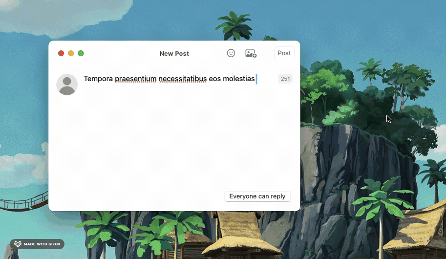
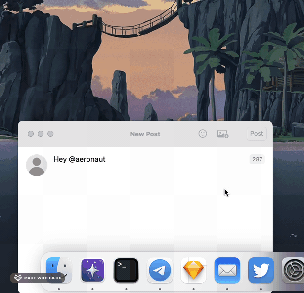
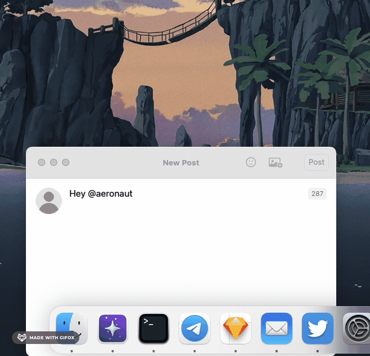

# Waitron

Popup windows for AppKit. Though intended for making autocomplete/typeahead-style UIs Waitron is designed to be as
agnostic as possible with regard to use-cases.



Waitron:

- ✅ Creates and controls the popup window
- ✅ Sizes and positions the window based on the `fittingSize` of your view
- ✅ Allows you to programmatically hide and show the window
- ✅ Automatically hides the window in response to clicks outside, the escape key being pressed, and [AppKit events](https://developer.apple.com/documentation/appkit/nsevent/eventsubtype#4009236)

And that’s all it does. For maximum flexibility Waitron is a Bring Your Own View Controller affair and the contents of
the window are entirely yours to manage.

## Installation

Waitron is installable using Swift Package Manager.

Add to your `package.swift`

```
.package(url: "https://github.com/mikeyclarke/Waitron.git", from: "1.0.0"),
```

Or through the Xcode UI:

- “Add Package Dependency…” (currently available from the File menu or in the right-click menu in the File Navigator)
- Enter the URL of this repository: `https://github.com/mikeyclarke/Waitron.git`
- Choose "Up To Next Major Version": 1.0.0

## Usage

### Initialization

Initialize a new `Waitron` with a view controller. Waitron holds a strong reference to your view controller and uses
generics so if your view controller is a subclass you can access it as its concrete type rather than needing to downcast
it.

```swift
class MyViewController: NSViewController { … }

let waitron = Waitron(viewController: MyViewController())
waitron.viewController // MyViewController
```

Your view controller’s view will automatically be added to the window and the window will be sized to match the
`fittingSize` of the view.

### Showing and hiding

To show the window provide either a `NSPoint` or `NSRect` in the screen of the parent window along with the parent
window itself. The left edge of the window will be aligned with the left edge of the rect if
`NSApp.userInterfaceLayoutDirection` is `leftToRight`, or right alignment will be used if it’s instead `rightToLeft`.

The window will be positioned below the rect provided there is space, otherwise it will be placed above.

To hide the window simply call `hide()`.

```swift
let rectInScreen: NSRect = …
let parentWindow: NSWindow = …

waitron.show(anchoredTo: rectInScreen, for: parentWindow)
waitron.hide()
```

### Sizing

The window is initially sized according to the `fittingSize` of your view controller’s view. If your view doesn’t have
a fixed size (e.g. if you have a table view and are doing something like
`heightConstraint.constant = min(maximumHeight, tableView.numberOfRows * tableView.rowHeight)`) then you should
programmatically update the window size whenever you update your height constraint:
`view.window?.setContentSize(view.fittingSize)`. Waitron observes window resize events and will automatically
reposition the window if necessary in response to its change in height.

#### Largest Expected Height

One thing to be aware of if your window has a dynamic height is that it may end up flipping between being positioned
below and positioned above as the height of the content changes and sometimes does but sometimes doesn’t fit below the
anchor rect.



To prevent this you can optionally tell Waitron the largest height you expect the window to be. Waitron will then
use this height instead of the current `fittingSize.height` when deciding whether to place the window above or below
the anchor rect.

```swift
// The window will always be placed above if there is less then 240px of space below even
// when the current height is less than 240.
waitron.largestExpectedHeight = 240
```



## Configuration

As you’re managing the window’s view yourself there isn’t much to configure. Currently the following three properties
of `Waitron` are configurable:

| Property | Type | Description |
| -------- | ---- | ----------- |
| `cornerRadius` | `CGFloat` | The corner radius of the window. |
| `visualEffectMaterial` | [`NSVisualEffectView.Material`](https://developer.apple.com/documentation/appkit/nsvisualeffectview/material) | The material for the window’s `NSVisualEffectView`. Defaults to `menu`. |
| `largestExpectedHeight` | `CGFloat?` | See [above](#largest-expected-height). |

Note that changing `cornerRadius` or `visualEffectMaterial` after the window has already been shown at least once will
have no effect.

## Tips

### Responding to window show/hide in your view controller

When the window is shown and hidden your view controller’s `viewDidAppear` and `viewDidDisappear` life-cyle methods will
be called as usual. If you’re using notifications or event monitors to sync up your window’s view with other parts of
your app you can use these two lifecyle methods to set them up and tear them down.

### Using with table views

By default AppKit will helpfully add an `NSVisualEffectView` to an `NSScrollView` that contains an `NSTableView`. Since
in this case the window already has an `NSVisualEffectView` with a `behindWindow` blending mode you’ll likely want to
prevent this which you can do so by setting:

```swift
scrollView.drawsBackground = false
tableView.backgroundColor = .clear
```

By default table rows use the selection color. You may prefer to use a visual effect with the [selection material](https://developer.apple.com/documentation/appkit/nsvisualeffectview/material/selection)
instead since it’s a little lighter and matches the appearance used in Spotlight, Reminders, and other of Apple’s own
macOS UIs. To do this you should create a subclass of `NSTableRowView`, insert an initially hidden visual effect
subview, override `isSelected` with a property observer that hides and shows the vfx view based on whether the row is
selected, and finally override the `drawSelection(in:)` method with a no-op.

## Requirements

- macOS 13+
- Swift 5

## License

Waitron is available under the MIT license. See [LICENSE](LICENSE) for details.
